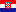

# Flame Flags

Flags used across LightSpeed products

This package only provides the raw SVG files as well as a spritesheet.

## How to use individual flags

Each flags are available within the `src` directory. Flag names must use their ISO country code.
It is also important to update the list of `flag-iso.list.json` with the new flag ISO and it's corresponding
country.

If you are within a context where you can import SVGs via import statements (you may need to include https://webpack.js.org/loaders/svg-inline-loader/), you may do the following:

```js
import CanadaFlagSVG from '@lightspeed/flame-flags/src/CA.svg';
// ...
<CanadaFlagSVG />;
```

## Using the spritesheet

Flags are available as a spritesheet. To add a spritesheet to an app, you can import it directly from your
node_modules or use an appropriate webpack-loader (such as https://webpack.js.org/loaders/svg-inline-loader/).

```html
<!--Including the spritesheet via the img tag-->

```

## How to contribute

Flags must be added to the `src` directory. Flag names must use their ISO country code.
It is also important to update the list of `flag-iso.list.json` with the new flag ISO and it's corresponding
country. If a flag is a specific region of a country (e.g: province, state, etc...)you must prefix that flag with
the ISO value of the country of origin.

For example, if adding the flag for the province of Quebec, the final flag name will be: `CA-QC.svg`.

Once that's done, please run `yarn regenerate-readme` and preview the README.md file to see if the flag renders correctly.

<!-- Everything underneath here is auto generated. Don't touch! -->

### Flag Preview

| Country/Region                               | Flag Code | Preview                        |
| -------------------------------------------- | --------- | ------------------------------ |
| Andorra                                      | AD        |      |
| United Arab Emirates                         | AE        |      |
| Afghanistan                                  | AF        |      |
| Antigua and Barbuda                          | AG        |      |
| Anguilla                                     | AI        |      |
| Albania                                      | AL        |      |
| Armenia                                      | AM        |      |
| Angola                                       | AO        |      |
| Antarctica                                   | AQ        |      |
| Argentina                                    | AR        |      |
| American Samoa                               | AS        |      |
| Austria                                      | AT        |      |
| Australia                                    | AU        |      |
| Aruba                                        | AW        |      |
| Åland                                        | AX        |      |
| Azerbaijan                                   | AZ        |      |
| Bosnia-Herzegovina                           | BA        |      |
| Barbados                                     | BB        |      |
| Bangladesh                                   | BD        |      |
| Belgium                                      | BE        |      |
| Burkina Faso                                 | BF        |      |
| Bulgaria                                     | BG        |      |
| Bahrain                                      | BH        |      |
| Burundi                                      | BI        |      |
| Benin                                        | BJ        |      |
| Bermuda                                      | BM        |      |
| Brunei                                       | BN        |      |
| Bolivia                                      | BO        |      |
| Bonaire                                      | BQ-BO     |   |
| Saba                                         | BQ-SA     |   |
| St Eustatius                                 | BQ-SE     |   |
| Brazil                                       | BR        |      |
| Bahamas                                      | BS        |      |
| Bhutan                                       | BT        |      |
| Botswana                                     | BW        |      |
| Belarus                                      | BY        |      |
| Belize                                       | BZ        |      |
| Canada                                       | CA        |      |
| Alberta                                      | CA-AB     |   |
| British Columbia                             | CA-BC     |   |
| Manitoba                                     | CA-MB     |   |
| New Brunswick                                | CA-NB     |   |
| Newfoundland and Labrador                    | CA-NL     |   |
| Nova Scotia                                  | CA-NS     |   |
| Northwest Territories                        | CA-NT     |   |
| Nunavut                                      | CA-NU     |   |
| Ontario                                      | CA-ON     |   |
| Prince Edward Island                         | CA-PE     |   |
| Quebec                                       | CA-QC     |   |
| Saskatchewan                                 | CA-SK     |   |
| Yukon                                        | CA-YT     |   |
| Cocos (Keeling) Islands                      | CC        |      |
| Congo D.R.                                   | CD        |      |
| Central African Rep.                         | CF        |      |
| Congo                                        | CG        |      |
| Switzerland                                  | CH        |      |
| Côte d'Ivoire                                | CI        |      |
| Cook Islands                                 | CK        |      |
| Chile                                        | CL        |      |
| Cameroon                                     | CM        |      |
| China                                        | CN        |      |
| Colombia                                     | CO        |      |
| Costa Rica                                   | CR        |      |
| Cuba                                         | CU        |      |
| Cape Verde                                   | CV        |      |
| Curaçao                                      | CW        |      |
| Christmas Island                             | CX        |      |
| Cyprus                                       | CY        |      |
| Czech Republic                               | CZ        |      |
| Germany                                      | DE        |      |
| Djibouti                                     | DJ        |      |
| Denmark                                      | DK        |      |
| Dominica                                     | DM        |      |
| Dominican Republic                           | DO        |      |
| Algeria                                      | DZ        |      |
| Ecuador                                      | EC        |      |
| Estonia                                      | EE        |      |
| Egypt                                        | EG        |      |
| Western Sahara                               | EH        |      |
| Eritrea                                      | ER        |      |
| Spain                                        | ES        |      |
| Catalonia                                    | ES-CT     |   |
| Ethiopia                                     | ET        |      |
| European Union                               | EU        |      |
| Finland                                      | FI        |      |
| Fiji                                         | FJ        |      |
| Falkland Islands                             | FK        |      |
| Micronesia                                   | FM        |      |
| Faroe Islands                                | FO        |      |
| France                                       | FR        |      |
| Gabon                                        | GA        |      |
| United Kingdom                               | GB        |      |
| England                                      | GB-ENG    |  |
| Scotland                                     | GB-SCT    |  |
| Wales                                        | GB-WLS    |  |
| Grenada                                      | GD        |      |
| Georgia                                      | GE        |      |
| Abkhazia                                     | GE-AB     |   |
| Guernsey                                     | GG        |      |
| Ghana                                        | GH        |      |
| Gibraltar                                    | GI        |      |
| Greenland                                    | GL        |      |
| Gambia                                       | GM        |      |
| Guinea                                       | GN        |      |
| Equatorial Guinea                            | GQ        |      |
| Greece                                       | GR        |      |
| South Georgia and the South Sandwich Islands | GS        |      |
| Guatemala                                    | GT        |      |
| Guam                                         | GU        |      |
| Guinea-Bissau                                | GW        |      |
| Guyana                                       | GY        |      |
| Hong Kong                                    | HK        |      |
| Honduras                                     | HN        |      |
| Croatia                                      | HR        |      |
| Haiti                                        | HT        |      |
| Hungary                                      | HU        |      |
| Indonesia                                    | ID        |      |
| Ireland                                      | IE        |      |
| Israel                                       | IL        |      |
| Isle of Man                                  | IM        |      |
| India                                        | IN        |      |
| British Indian Ocean Terr.                   | IO        |      |
| Iraq                                         | IQ        |      |
| Iran                                         | IR        |      |
| Iceland                                      | IS        |      |
| Italy                                        | IT        |      |
| Jersey                                       | JE        |      |
| Jamaica                                      | JM        |      |
| Jordan                                       | JO        |      |
| Japan                                        | JP        |      |
| Kenya                                        | KE        |      |
| Kyrgyzstan                                   | KG        |      |
| Cambodia                                     | KH        |      |
| Kiribati                                     | KI        |      |
| Comoros                                      | KM        |      |
| Saint Kitts and Nevis                        | KN        |      |
| North Korea                                  | KP        |      |
| South Korea                                  | KR        |      |
| Kuwait                                       | KW        |      |
| Cayman Islands                               | KY        |      |
| Kazakhstan                                   | KZ        |      |
| Laos                                         | LA        |      |
| Lebanon                                      | LB        |      |
| Saint Lucia                                  | LC        |      |
| Liechtenstein                                | LI        |      |
| Sri Lanka                                    | LK        |      |
| Liberia                                      | LR        |      |
| Lesotho                                      | LS        |      |
| Lithuania                                    | LT        |      |
| Luxembourg                                   | LU        |      |
| Latvia                                       | LV        |      |
| Libya                                        | LY        |      |
| Morocco                                      | MA        |      |
| Monaco                                       | MC        |      |
| Moldova                                      | MD        |      |
| Montenegro                                   | ME        |      |
| Madagascar                                   | MG        |      |
| Marshall Islands                             | MH        |      |
| Macedonia                                    | MK        |      |
| Mali                                         | ML        |      |
| Burma                                        | MM        |      |
| Mongolia                                     | MN        |      |
| Macau                                        | MO        |      |
| Northern Mariana Islands                     | MP        |      |
| Martinique                                   | MQ        |      |
| Mauritania                                   | MR        |      |
| Malta                                        | MT        |      |
| Mauritius                                    | MU        |      |
| Maldives                                     | MV        |      |
| Malawi                                       | MW        |      |
| Mexico                                       | MX        |      |
| Malaysia                                     | MY        |      |
| Mozambique                                   | MZ        |      |
| Namibia                                      | NA        |      |
| New Caledonia                                | NC        |      |
| Niger                                        | NE        |      |
| Norfolk Island                               | NF        |      |
| Nigeria                                      | NG        |      |
| Nicaragua                                    | NI        |      |
| Netherlands                                  | NL        |      |
| Norway                                       | NO        |      |
| Nepal                                        | NP        |      |
| Nauru                                        | NR        |      |
| Niue                                         | NU        |      |
| New Zealand                                  | NZ        |      |
| Oman                                         | OM        |      |
| Panama                                       | PA        |      |
| Peru                                         | PE        |      |
| French Polynesia                             | PF        |      |
| Papua New Guinea                             | PG        |      |
| Philippines                                  | PH        |      |
| Pakistan                                     | PK        |      |
| Poland                                       | PL        |      |
| Pitcairn Islands                             | PN        |      |
| Puerto Rico                                  | PR        |      |
| Palestine                                    | PS        |      |
| Portugal                                     | PT        |      |
| Palau                                        | PW        |      |
| Paraguay                                     | PY        |      |
| Qatar                                        | QA        |      |
| Réunion                                      | RE        |      |
| Romania                                      | RO        |      |
| Serbia                                       | RS        |      |
| Russia                                       | RU        |      |
| Rwanda                                       | RW        |      |
| Saudi Arabia                                 | SA        |      |
| Solomon Islands                              | SB        |      |
| Seychelles                                   | SC        |      |
| Sudan                                        | SD        |      |
| Sweden                                       | SE        |      |
| Singapore                                    | SG        |      |
| Saint Helena                                 | SH-HL     |   |
| Slovenia                                     | SI        |      |
| Slovakia                                     | SK        |      |
| Sierra Leone                                 | SL        |      |
| San Marino                                   | SM        |      |
| Senegal                                      | SN        |      |
| Somalia                                      | SO        |      |
| Suriname                                     | SR        |      |
| South Sudan                                  | SS        |      |
| Sao Tome and Principe                        | ST        |      |
| El Salvador                                  | SV        |      |
| Sint Maarten                                 | SX        |      |
| Syria                                        | SY        |      |
| Swaziland                                    | SZ        |      |
| Turks and Caicos Islands                     | TC        |      |
| Chad                                         | TD        |      |
| French Southern Territories                  | TF        |      |
| Togo                                         | TG        |      |
| Thailand                                     | TH        |      |
| Tajikistan                                   | TJ        |      |
| Tokelau                                      | TK        |      |
| Timor-Leste                                  | TL        |      |
| Turkmenistan                                 | TM        |      |
| Tunisia                                      | TN        |      |
| Tonga                                        | TO        |      |
| Turkey                                       | TR        |      |
| Trinidad and Tobago                          | TT        |      |
| Tuvalu                                       | TV        |      |
| Taiwan                                       | TW        |      |
| Tanzania                                     | TZ        |      |
| Ukraine                                      | UA        |      |
| Uganda                                       | UG        |      |
| United States of America                     | US        |      |
| Uruguay                                      | UY        |      |
| Uzbekistan                                   | UZ        |      |
| Vatican                                      | VA        |      |
| St Vincent & the Grenadines                  | VC        |      |
| Venezuela                                    | VE        |      |
| British Virgin Islands                       | VG        |      |
| U.S. Virgin Islands                          | VI        |      |
| Vietnam                                      | VN        |      |
| Vanuatu                                      | VU        |      |
| Samoa                                        | WS        |      |
| Kosovo                                       | XK        |      |
| Yemen                                        | YE        |      |
| Mayotte                                      | YT        |      |
| South Africa                                 | ZA        |      |
| Zambia                                       | ZM        |      |
| Zimbabwe                                     | ZW        |      |
|                                              | ZZ        |      |
